# Spring Boot 3 JWT Security Demo
Security operations carried out in the project:
* Register
* Login (authenticate)
* Refresh Token
* Logout
* Authorization

# Database
In the project, PostgreSQL DB is using. You can install locally or use docker. For docker, run the commands:

``` shell
docker pull postgres
```

``` shell
docker run --name postgresql -e POSTGRES_USER=postgres -e POSTGRES_PASSWORD=postgres123 -p 5432:5432 -d postgres
```

Then, connect to teh database and create new database with name 'jwt_security'.

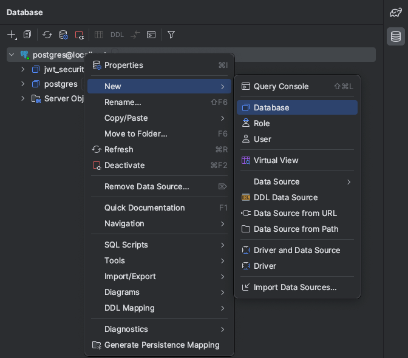

# Register
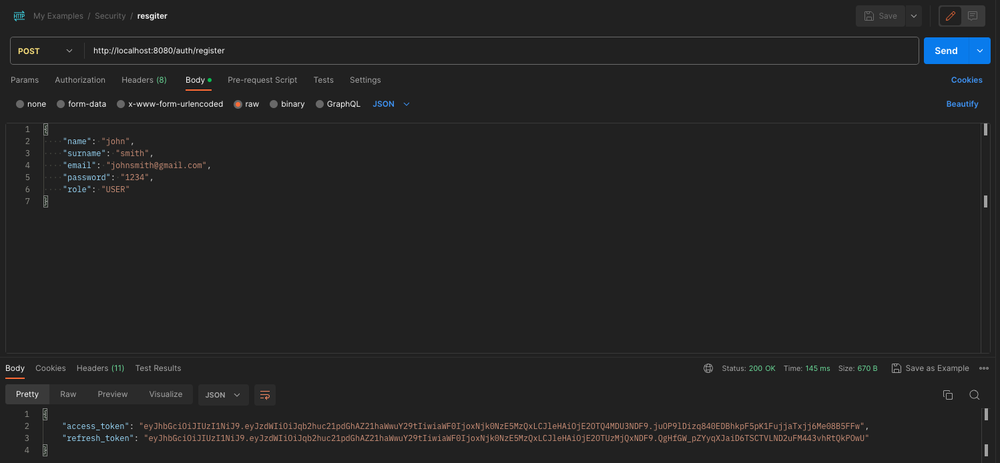

Users are saved in the '_user' table.

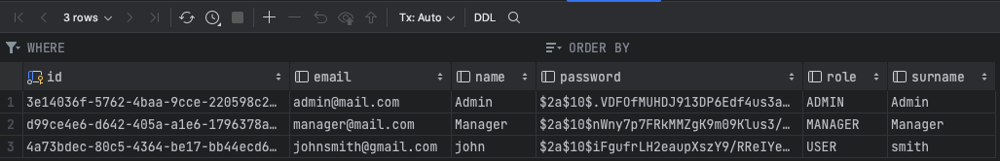

Admin and Manager are created automatically.

# Login (authenticate)
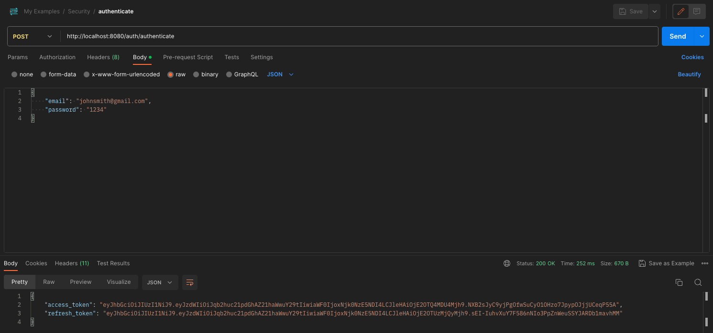

# Refresh Token
By using refresh token, get access token and new refresh token.

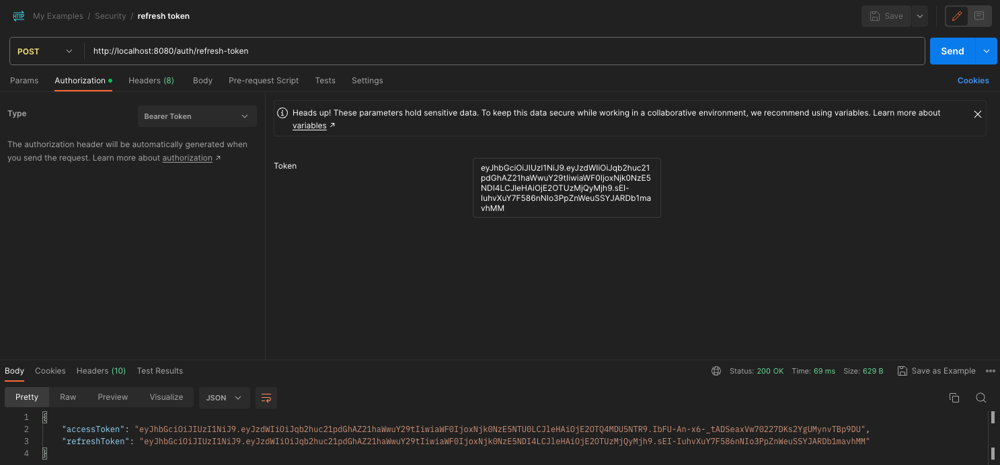

# Logout
By using access token, send request.

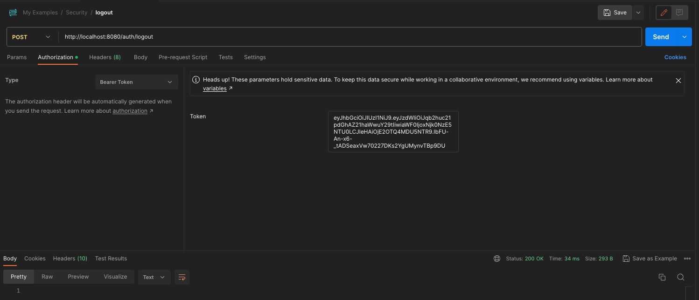

# Token
All user tokens are stored to token table.

When users logout or refresh token, then the token revoked.

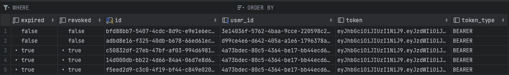

When the application runs, an admin and a manager users are generated. Their tokens are logged.

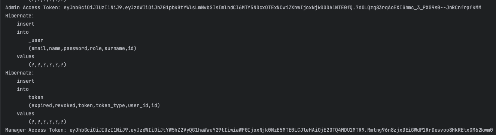

By using these tokens, you can send request to admin and management controllers.

# Admin Test
The admin has all authorities.

## Admin Controller
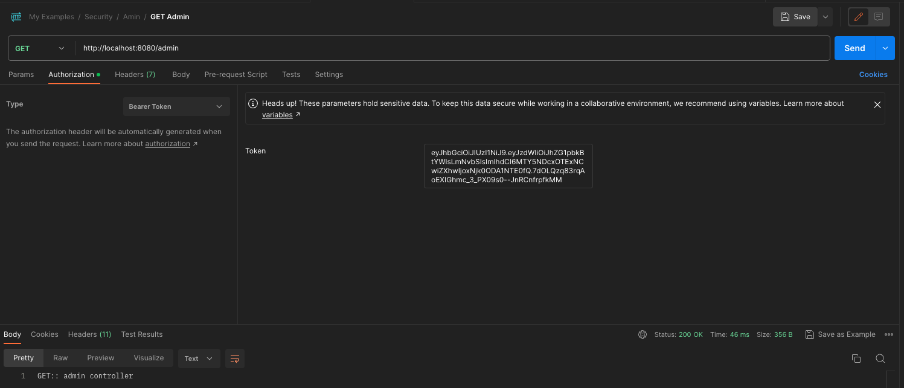

## Management Controller
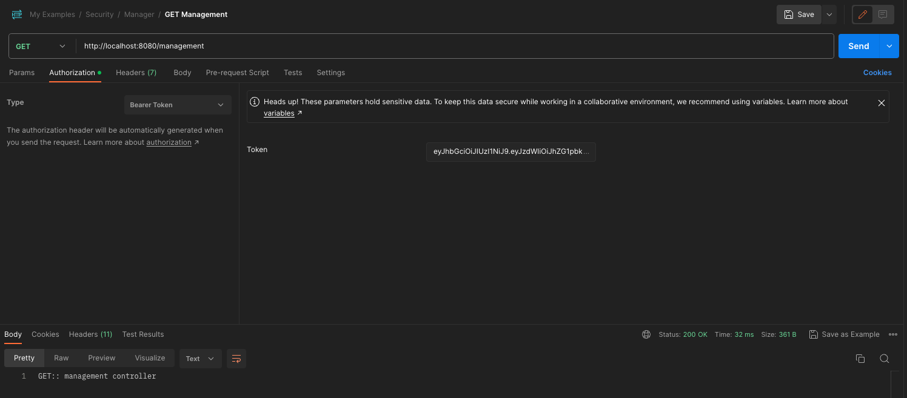

# Manager Test
The manager only has the authority to send requests to the management controller.

## Admin Controller
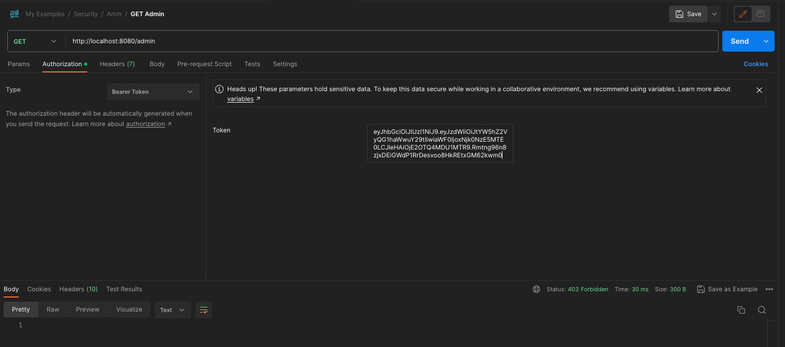

## Management Controller
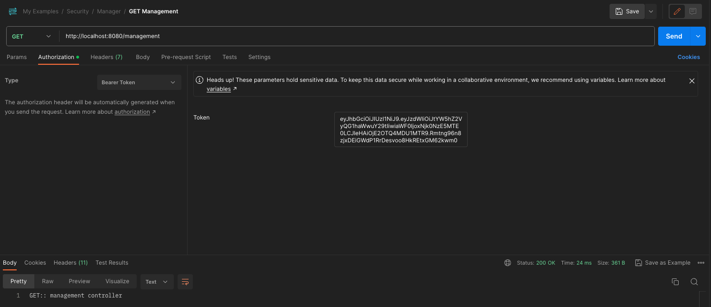

# Reference
Bouali Ali Youtube Channel. Videos:
* [Spring Boot 3.0 Secure your API with JWT Token](https://youtu.be/BVdQ3iuovg0?si=n7qArn7X12sJ1Fw0)
* [How to Logout from Spring Security - JWT](https://youtu.be/0GGFZdYe-FY?si=a0VMOkXjUb5TLZI4)
* [Spring Security - Refresh Token](https://youtu.be/EsVybSJr7zU?si=_uSNXbgFJnXxB0bq)
